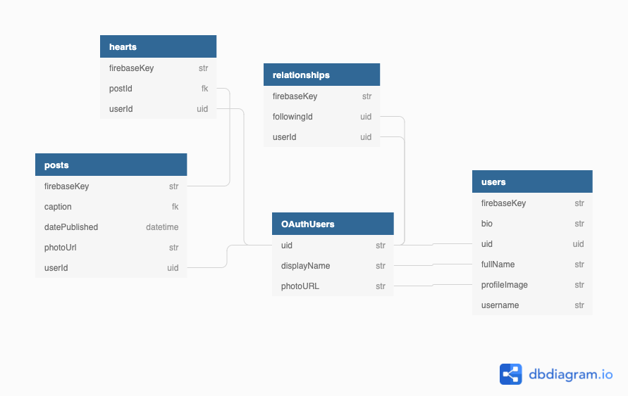

# Instasham
You were hired on a team to work on a social media application called Instasham. The designers have already created their mocks ups for the components and the Component Library has already been made. It's your team's job to use the Component library to build out the whole application with functionality.

This repo already has some components for you to use to complete this project. When you first start this app, they are all loaded on the DOM for you to play around with and to see an example of it implemented. DO NOT update the components in the `instasham-design-system` directory. You must use them as is. You can update the styles for these components to better fit your companies theme.

Because a backend with endpoints has not been created yet, there are also incomplete helper functions that these components need to function properly. Part of your team’s job is to create a Firebase backend using the provided ERD and complete the helper functions. Don't worry, each incomplete function can be found by searching for the TODO keyword and there are notes provided for assistance.

A list of what the Product team wants this application to do is listed below. Within that list are the exact routes needed, what components are needed in each view, and even some stretch goals. Your team’s job is to create tickets from this list of features and stick to the list. Though if you have any questions, I'm sure the Product team is open to feedback, but they want this product to look as close to this example here: https://trinstasham.netlify.app/

## Setup Instructions
1. Install Dependencies `npm i`
1. Start App `npm start`

## Feature List
- General
  - Each user should have a user object in firebase.
  - When getting the current date use the `getCurrentDate` function in `/helpers/dateHelper.js`.
  - Get username from characters before @ in user's email address. Ex: if the email is "trinity@me.com", the username would be "trinity".
  - Don't use the Firebase key from the user node when referencing a user, always use the uid from the auth user.
  - Do not update the components file. You may update the styles, but do not update the React code itself.
- Login Page
  - At route path: `/login`
  - Shows up if the user's not logged in
  - User can log in to the app using Google auth
- Feed Page
  - At route path: `/`
  - Components Used:
    - Use `PostDetailCard` component to show a single post
  - A feed with all posts posted in the app
  - Stretch: Only show own posts and posts of people you follow
- Browse Page
  - At route path: `/browse`
  - Components Used:
    - Use the `UsersList` component to show the user list
  - A list of all the users on the app
  - The ability to search through the users by name and username
- Create Post
  - At route path: `/create`
  - Has a form to create a post. (Look at ERD for data structure)
  - Stretch: Use Firebase cloud storage to allow image upload.
- Edit Post
  - At route path: `/edit/{{ postId }}`
  - Has a prepopulated form to update a post. (Look at ERD for data structure)
  - Stretch: If `postId` in url is to a post that does not belong to the current user or does not exist, redirect them to the home page.
- Heart Page `/hearts`
  - At route path: `/hearts`
  - Components Used:
    - Use `PostDetailCard` component to show a single post
  - Shows all the posts a user has hearted.
- Profile View
  - At route path: `/sham/{{ username }}`
  - Components Used:
    - Use the `PostGrid` component to show a preview of all the user's posts
    - Use the `ProfileInfo` component to show user information
  - View how many posts a user has
  - View how many followers a user has
  - View how many people a user follows
  - View user's image, bio, and full name
  - View preview of all post user has
  - If not looking at the current user, allow the user to follow or unfollow a user
  - If looking at the current user, have a button that allows them to go to a settings page.
- Post Details Page
  - At route path: `/posts/{{ postId }}`
  - Components Used:
    - Use `PostDetailCard` component to show a single post
  - Shows a post based on the id in the url
- Settings page
  - Allow user to update their bio
  - Allow user to logout
- Navbar
  - Here is how to implement the Navbar
  ```jsx
  <AppNavbar userInfo={{/* Pass in User Object from user node */}} />
  <div className='app-container'>
    {/* The rest of the application should be loaded here */}
  </div>
  ```

## ERD

<a href="https://dbdiagram.io/d/6099dd88b29a09603d1444c2"></a>


